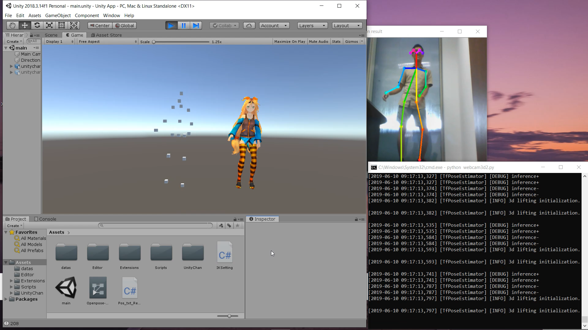

# real-time-3d-pose-estimation-with-Unity3D-public

### The result is not very good, but I am satisfied with it.
### Demo video smoothed: https://www.youtube.com/watch?v=JnFtVC0ou6I&t=2s

### video:

### Same video not smoothed: https://www.youtube.com/watch?v=wye4tFp7HP8&t=28s

### webcam:

### Webcam video demo: https://youtu.be/WJVNDUkx74s

# How do I make it: 
### 1. I use the run.py code from this link to generate 3d coordinates of body parts. Then did some data transformation. https://qiita.com/keel/items/0d64167850566586d22a
### 2. Modified above code to be able to send coordinates to Unity3D using "socket" package.
### 3. Create an Unity App based on https://github.com/keel-210/OpenPose-Rig.
### 4. I learn from this code to make character move. https://qiita.com/kenkra/items/7b5634ff7f8c6bf0257a

